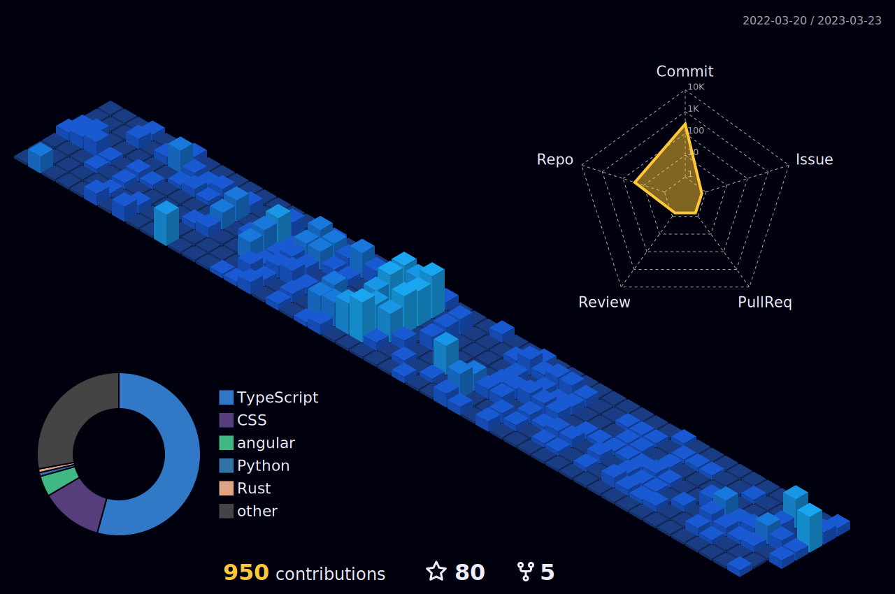

  
  
  <a href="https://github.com/elbayoumi">
    

      
    

  </a>

<!--     ///////// -->

  

  
    
   
      

  

  
 

  <h2>
    
    How to reach me
    
  </h2>
   
  
  &nbsp;&nbsp;
  
  &nbsp;&nbsp; 
   
  &nbsp;&nbsp;
  
  &nbsp;&nbsp;
  
  &nbsp;&nbsp;
  

<!--  -->
<!-- 

 -->
 

